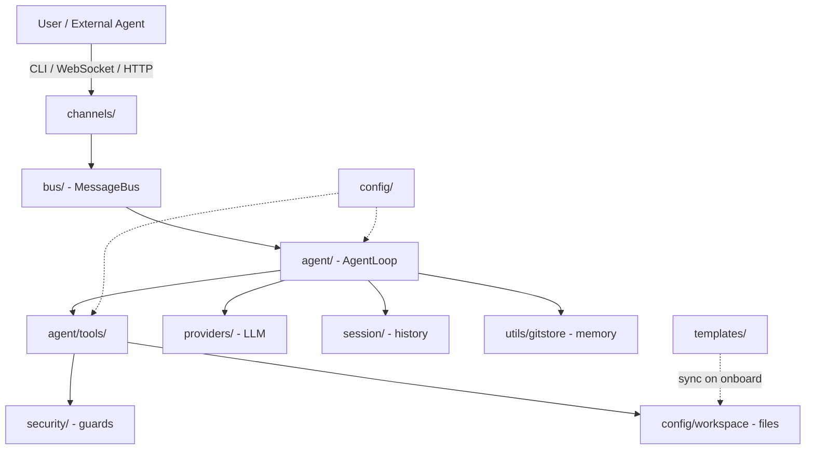

# Femtobot

<div align="center">
  
</div>

<div align="center">

[](https://www.python.org/)
[](./LICENSE)
[](./pyproject.toml)
[](./tests/)
[](./pyproject.toml)

**A lightweight, CLI-first AI agent foundation for multi-agent systems.**

</div>

---

## Overview

**Femtobot** is a minimal, production-oriented AI agent built around a single principle: the command line is the right interface for engineers, and the network is the right interface for agents. It started as a focused derivative of [Nanobot](https://github.com/HKUDS/nanobot) and is being developed as part of the [percival.OS](https://github.com/bill-kopp-ai-dev/percival.OS) ecosystem.

Femtobot is designed to be a practical foundation for building specialized "worker" agents that plug into multi-agent architectures — Supervisor/Worker, Hierarchical, or Swarm — through a clean OpenAI-compatible API. Each Femtobot instance is a self-contained, containerizable unit: drop it into a Docker container, point it at any OpenAI-compatible LLM endpoint, and it is ready to serve requests or coordinate with peers.

## Why Femtobot

- **CLI-first.** No GUI to install, no dashboard to babysit. The terminal is the operator's surface; the HTTP/WebSocket surface is for other agents.
- **Multi-instance by design.** Run `.femtobot` for the default profile, `.femtobot_dev` for development, `.femtobot_billing` for production — all in parallel, fully isolated, no port collisions.
- **A2A-ready.** The built-in `femtobot serve` already speaks the OpenAI Chat Completions protocol, so any agent that can call OpenAI can call Femtobot. Stage 2 adds native Docker orchestration on top.
- **30 LLM providers out of the box.** Declarative `ProviderSpec` registry covers OpenAI, Anthropic (via compatible gateways), AWS Bedrock (first-class), Ollama, vLLM, LM Studio, OpenVINO Model Server, and 24 regional providers (Mistral, Groq, NVIDIA NIM, Zhipu, DashScope, Moonshot, VolcEngine, BytePlus, …). See [`docs/providers.md`](./docs/providers.md).
- **Workspace-scoped safety.** Tools are sandboxed to a per-instance workspace, with SSRF protection, command guards, and a deny-list for destructive shell operations.
- **Minimal surface area.** Roughly 17,000 lines of Python across 80 well-scoped modules. No social channels, no embedded web UI, no bundled frontend assets.

## Optimized for: MCP Server Pairings

Femtobot is **optimized to work in tandem** with the following MCP
(Model Context Protocol) servers, which wrap external CLI agents and
expose them as tools to Femtobot's LLM loop:

- [`antigravity-cli-mcp`](https://github.com/bill-kopp-ai-dev/antigravity-cli-mcp)
  — Gemini CLI wrapper. Exposes `agy_run_task`, `agy_health`, and
  friends. Recommended for long-horizon autonomous refactors and
  planning tasks.
- [`claude-code-cli-mcp`](https://github.com/bill-kopp-ai-dev/claude-code-cli-mcp)
  — Claude Code CLI wrapper. Exposes `claude_run_task`,
  `claude_health`, and friends. Recommended for focused coding tasks
  and quick reviews.

These integrations ship as first-class features:

- **`/mcp` slash command** — `status`, `reload`, `tools <server>`,
  `restart <server>` for runtime inspection and recovery.
- **`mcp-router` skill** — teaches the LLM when to delegate to
  `agy_run_task` / `claude_run_task` vs. solving locally with
  `read_file`, `apply_patch`, etc.
- **Capability tags** — tool hints now show
  `[long-running, safe-mode:confirm]` for run_task tools, so the model
  recognizes the `confirm` gate before invoking them.
- **Workspace auto-fill** — `agy_run_task` and `claude_run_task` calls
  get `workspace_path` filled in automatically from the active
  request context.
- **System-prompt blocks** — `## MCP Servers in this workspace` lists
  each connected server and its tools; `## MCP Persistence Pointers`
  (opt-in) reads AGENTS.md / MEMORY.md headers from the MCPs so the
  LLM has context continuity across delegations.
- **Startup health check** — when a configured MCP fails to connect,
  Femtobot surfaces a visible warning (opt-in via
  `agents.defaults.notifyMcpStartupFailures`).

See [`docs/mcp.md`](./docs/mcp.md) §8 "Femtobot-specific patterns" for
the full reference.

## Features

### Agent core
- Async agent loop with streaming responses
- 22 native tools: `read_file`, `write_file`, `apply_patch`, `exec` (sandboxed shell), `exec_session`, `grep`, `find_files`, `web_search`, `web_fetch`, `message`, `self`, `mcp`, `my`, **`femtobot_timer`**, and more
- Tool schema built on a Template Method pattern with Pydantic v2
- Auto-compaction when the context window fills up
- Multi-turn continuation when the LLM hits its tool-call budget
- Slash command router (`/help`, `/status`, `/goal`, `/style`, etc.)

### Workspaces and memory
- Per-instance workspaces with Git-backed memory (`MEMORY.md`, `history.jsonl`)
- Template seeding: `AGENTS.md`, `SOUL.md`, `USER.md` are synced on first run
- Workspace policy enforcement: tools cannot escape the project root
- Persistent session history with JSONL serialization (CLI-managed via `femtobot sessions`)

### Channels and transport
- WebSocket channel (the main interactive surface)
- aiohttp server exposing OpenAI-compatible endpoints (`/v1/chat/completions`, `/v1/models`, `/health`)
- Message bus for in-process pub/sub between subsystems

### Security
- SSRF protection on all HTTP-fetching tools
- Command guard with a deny-list of destructive shell patterns
- Workspace access scoping per turn
- Per-instance isolation (no cross-talk between `.femtobot_*`)

### Multi-provider LLM support
- Unified `openai_compat_provider` for any OpenAI-compatible endpoint (29 of 30 providers)
- First-class AWS Bedrock provider (`BedrockProvider`, not OpenAI-compat)
- Fallback provider with circuit-breaker semantics
- Preset system for one-line model swaps
- Multi-provider config (mix OpenAI, Anthropic, Bedrock, and a local Ollama in the same instance)

### Operational
- Typer-based CLI with Rich-formatted output
- Loguru logging with bridge to stdlib
- Single-file config (`config.json`) per instance
- Easy to containerize (no state outside the instance directory)
- New in v0.1.7: opt-in wizard (`femtobot onboard --wizard`); silent install by default
- New in v0.1.8: `femtobot sessions {list,show,delete}` CLI for managing the workspace/sessions directory

## Project Status

### Stage 1 — Femtobot Core (MVP CLI) — **Completed** (v0.1.8)
- [x] CLI framework (Typer + Rich)
- [x] Agent loop with LLM integration (OpenAI-compatible, Bedrock)
- [x] 22 native tools (filesystem, shell, web, MCP, self-tools, **femtobot_timer**)
- [x] Multi-instance support (`onboard`, `status`, `agent`, `serve`, `gateway`, **`sessions`**)
- [x] Configuration via `config.json` (multi-provider)
- [x] Workspace management with `SOUL.md` / `USER.md` / `AGENTS.md` templates
- [x] WebSocket channel
- [x] OpenAI-compatible API server (`femtobot serve`)
- [x] Security: SSRF guard, workspace policy, command guard
- [x] Memory: workspace-scoped, Git-backed (`gitstore`) + Dream consolidation
- [x] MCP integration + auto-discovery
- [x] Auto-compact context + turn continuation
- [x] Documented provider inventory (`docs/providers.md`)
- [x] Session-management CLI (`femtobot sessions list|show|delete`)

### Stage 2 — A2A + Docker Integration — **Planned**
- [ ] Docker SDK integration for spawning worker containers
- [ ] A2A client for inter-agent communication
- [ ] Supervisor orchestration (percival.OS → Femtobot workers)
- [ ] Optional FastAPI upgrade for the A2A server

## Installation

Femtobot uses [uv](https://docs.astral.sh/uv/) for dependency management.

### Prerequisites

- Python 3.11 or newer
- [`uv`](https://docs.astral.sh/uv/getting-started/installation/) installed
- A Unix-like shell (Linux, macOS, or WSL)

### From source

```bash
git clone https://github.com/bill-kopp-ai-dev/femtobot.git
cd femtobot
uv sync
```

This will create a virtual environment and install all dependencies into `.venv/`.

### Verify the installation

```bash
uv run python -m femtobot --version
```

You should see:

```
███████╗ ███████╗ ███╗   ███╗ ████████╗ ...
Femtobot v0.1.8
```

## Quick Start

```bash
# 1. Initialize a default instance in the current directory
uv run femtobot onboard

# 2. Verify the instance is wired up
uv run femtobot status

# 3. Run the agent in single-shot mode
uv run femtobot agent -m "what time is it?"

# 4. Or start an interactive session
uv run femtobot agent
```

That's it. Femtobot will sync the workspace templates, read your `config.json`, connect to the configured LLM provider, and start chatting.

## CLI Reference

Femtobot exposes a small, focused set of commands. Run `uv run femtobot --help` to see them all.

### Core commands

| Command | Purpose |
|---|---|
| `femtobot onboard` | Initialize a new instance (silent default; opt-in wizard via `--wizard`) |
| `femtobot status` | Show instance status (config path, workspace, active model) |
| `femtobot agent` | Run the agent (interactive or `-m "..."` single-shot) |
| `femtobot serve` | Start the OpenAI-compatible HTTP server |
| `femtobot gateway` | Start the WebSocket gateway |

### Subcommands

| Command | Purpose |
|---|---|
| `femtobot sessions list` | List every persisted session (size, updated_at, message_count) |
| `femtobot sessions show <key>` | Print metadata + last 5 messages of one session |
| `femtobot sessions delete <key>` | Remove a session file (and any legacy copies) |
| `femtobot config validate` | Validate the active `config.json` |
| `femtobot tools list` | List all registered native tools |

### `femtobot onboard`

Initialize a new Femtobot instance. Creates the instance directory, writes a default `config.json`, and syncs the workspace templates. v0.1.7 made the wizard strictly opt-in: a plain `femtobot onboard` runs silently (no interactive prompts), and `femtobot onboard --wizard` opens the 3-step Quick Start wizard.

```bash
# Default instance at ./.femtobot/   (silent install, v0.1.7+)
uv run femtobot onboard

# Named instance at ./.femtobot_dev/
uv run femtobot onboard --suffix dev

# Instance in a specific parent folder
uv run femtobot onboard --folder-path /opt/agents --suffix billing

# Overwrite an existing config.json
uv run femtobot onboard --suffix dev --force

# Run the interactive onboarding wizard
uv run femtobot onboard --wizard
```

| Option | Alias | Description |
|---|---|---|
| `--suffix` | `-s` | Instance suffix (e.g. `dev`, `prod`, `billing`) |
| `--folder-path` | `-f` | Parent folder for the instance |
| `--force` |  | Overwrite an existing `config.json` |
| `--wizard` |  | Run the interactive wizard (v0.1.7+) |

### `femtobot sessions {list,show,delete}`

Manage persisted session files in `workspace/sessions/`. v0.1.8 introduced this CLI group; previously the underlying `SessionManager.delete_session` method was unreachable dead code.

```bash
uv run femtobot sessions list                              # Show all sessions, newest first
uv run femtobot sessions show cli:direct                   # Metadata + last 5 messages
uv run femtobot sessions delete cli:test --yes             # Delete (with confirmation)
```

### `femtobot status`

Show the current instance status: config path, workspace path, active model, and configured providers.

```bash
uv run femtobot status
uv run femtobot status --suffix dev
```

### `femtobot agent`

Run the agent. In interactive mode (no `-m`), you get a prompt; with `-m`, the agent runs a single turn and exits.

```bash
# Interactive
uv run femtobot agent
uv run femtobot agent --suffix dev

# Single-shot
uv run femtobot agent -m "Explain the layout of this codebase"
uv run femtobot agent --suffix prod -m "Summarize the last 5 commits"

# Need the time? Use the femtobot_timer tool
uv run femtobot agent -m "what time is it?"
```

### `femtobot serve`

Start the OpenAI-compatible HTTP server. Other agents and tools can then call the agent via `POST /v1/chat/completions`.

```bash
uv run femtobot serve
uv run femtobot serve --suffix dev --host 0.0.0.0 --port 8000
```

| Endpoint | Method | Description |
|---|---|---|
| `/v1/chat/completions` | POST | OpenAI-compatible chat completion |
| `/v1/models` | GET | List available models |
| `/health` | GET | Liveness check |

### `femtobot gateway`

Start the WebSocket gateway. This is the primary interactive channel for clients that prefer a persistent connection.

```bash
uv run femtobot gateway
uv run femtobot gateway --suffix dev
```

## Multi-Instance Model

Femtobot supports multiple isolated instances on the same machine. Each instance has its own config, workspace, history, and port. The instance directory is determined by the `--suffix` and `--folder-path` flags, with the following resolution order:

1. `--config <path>` (if implemented in the future)
2. `--folder-path <path>` + `--suffix <suffix>` → `<path>/.femtobot_<suffix>/`
3. `FEMTOBOT_HOME` environment variable → `$FEMTOBOT_HOME/.femtobot_<suffix>/`
4. Current working directory: `./.femtobot_<suffix>/` (or `./.femtobot/` for the default)

Common directory layouts:

```text
.femtobot/                 # default instance
.femtobot_dev/             # development instance
.femtobot_prod/            # production instance
```

The suffix must match `[a-zA-Z0-9_-]+`. Examples of valid suffixes: `dev`, `prod`, `billing_2024`, `agent-test`. Invalid: `dev env`, `test/path`, `..`.

### Environment variables

| Variable | Description |
|---|---|
| `FEMTOBOT_HOME` | Sets a fixed instance root directory |
| `FEMTOBOT_TMUX_SOCKET_DIR` | Directory for tmux sockets used by the gateway |
| `OPENAI_API_KEY` | OpenAI / several gateway providers (see `docs/providers.md`) |
| `ANTHROPIC_API_KEY` | Anthropic provider (also reachable via gateways) |
| `BEDROCK_*` | AWS region + credentials for the Bedrock provider |
| Provider-specific | See [`docs/providers.md`](./docs/providers.md) §"Environment-variable cheat-sheet" |

## Configuration

Each instance stores its configuration at `<instance_dir>/config.json`. Keep secrets out of version control.

### Minimal `config.json`

```json
{
  "agents": {
    "defaults": {
      "model": "gpt-4o-mini",
      "workspace": "./workspace"
    }
  },
  "providers": {
    "openai": {
      "type": "openai_compat",
      "base_url": "https://api.openai.com/v1",
      "api_key": "${OPENAI_API_KEY}"
    }
  }
}
```

### Top-level keys

| Key | Purpose |
|---|---|
| `agents.defaults` | Default agent behavior (model, workspace, max iterations) |
| `agents.list` | Named agent profiles |
| `providers` | LLM provider registry (OpenAI, Anthropic, Bedrock, custom gateways) |
| `tools` | Tool enable/disable and per-tool configuration (incl. `tools.timer`, `tools.web`, `tools.exec`, `tools.mcp_servers`) |
| `security` | Workspace policy, command guard settings |
| `gateway` | Gateway host/port |
| `api` | OpenAI-compat server host/port |

Environment variables in config values (e.g. `${OPENAI_API_KEY}`) are expanded at load time.

For every supported provider (OpenAI, Bedrock, Anthropic via gateway, Ollama, vLLM, Mistral, Groq, NVIDIA NIM, Zhipu, DashScope, Moonshot, VolcEngine, BytePlus, Qianfan, Ant Ling, LongCat, …) see [`docs/providers.md`](./docs/providers.md).

## Workspace

Each instance has a workspace directory. By default it lives at `<instance_dir>/workspace/`. The workspace is the only directory the agent's tools can read from and write to (unless explicitly granted wider access).

```text
.femtobot/
├── config.json
├── history/
│   └── cli_history
└── workspace/
    ├── AGENTS.md           # system prompt seeding
    ├── SOUL.md             # persona file
    ├── USER.md             # user profile
    ├── .templates/         # cached template copies
    ├── memory/
    │   ├── MEMORY.md
    │   └── history.jsonl
    ├── sessions/           # per-session JSONL logs (manage via `femtobot sessions`)
    ├── tool_results/       # cached tool outputs
    └── artifacts/          # generated files
```

`AGENTS.md`, `SOUL.md`, and `USER.md` are seeded from the bundled `templates/` directory on first run and never overwritten. You can edit them freely.

## Tools

Femtobot ships with a curated set of native tools. Each tool is implemented as a subclass of `Tool` (in `femtobot/agent/tools/base.py`) and auto-discovered by the `ToolLoader`. New tools dropped into `femtobot/agent/tools/*.py` are picked up automatically.

| Tool | Purpose |
|---|---|
| `read_file` | Read a file from the workspace, with image MIME detection |
| `write_file` | Write or overwrite a file in the workspace |
| `apply_patch` | Apply a unified diff / patch |
| `exec` | Run a shell command (sandboxed by `command_guard`) |
| `exec_session` | Run a long-lived interactive shell session |
| `grep` | Ripgrep-style content search across the workspace |
| `find_files` | Glob/find files by name pattern |
| `web_search` | Search the web via a configured provider |
| `web_fetch` | Fetch and extract content from a URL |
| `message` | Send a message back to the user (the "final answer" tool) |
| `self` | Read/write the agent's own runtime variables |
| `my` | Introspection tool for runtime state |
| `mcp` | Bridge to Model Context Protocol servers |
| **`femtobot_timer`** | UTC + user-local + calendar (timezone / DST aware) |

Tools are configurable per-instance via the `tools` section of `config.json`. You can disable specific tools or tune their parameters (timeouts, max output, allow-lists).

## Architecture

Femtobot is organized in clear layers, from the user surface down to the LLM provider:



Layer responsibilities:

| Layer | Responsibility |
|---|---|
| `cli/`, `channels/` | User-facing input (terminal, WebSocket, HTTP) |
| `bus/` | In-process event bus decoupling producers from consumers |
| `session/` | Per-conversation state, goals, turn continuation |
| `agent/` | The core loop, runner, context window management, memory |
| `agent/tools/` | Concrete capabilities the LLM can invoke (auto-discovered) |
| `providers/` | LLM API abstraction (unified OpenAI-compat layer + Bedrock) |
| `security/` | SSRF, command guard, workspace policy |
| `config/` | Pydantic schema, JSON loader, path resolution |
| `templates/` | Bundled system-prompt seeds |
| `utils/` | Shared helpers (path, runtime, logging, gitstore) |

### Release milestones

Femtobot's history is structured as a series of **Lote** (batches) shipping on a Lote E–P lineage. The current release is **v0.1.8**.

| Lote | Version | Theme | Items | Tests added | Cumulative |
|------|---------|-------|-------|-------------|-----------:|
| P | v0.1.8 | Session-Manager parity push (5 issues) | 5 fixes + 1 revert + 1 new CLI group | 9 | 718 |
| O | v0.1.7 | CLI `onboard` opt-in wizard + auto-discovery | 7 fixes | 15 | 709 |
| N-doc | – | Provider inventory doc | 1 doc | – | – |
| N | v0.1.6 | New tool: `femtobot_timer` (port of `nano_timer`) | 1 tool + 1 config | 24 | 694 |
| L | v0.1.5 | Dream consolidation parity close-out (R1–R6) | 6 fixes | 20 | 670 |
| L | v0.1.4 | nanobot-parity hardening (W1–W5) | 3 helpers | 21 | 650 |
| K | v0.1.3 | Runner early-exit hotfix | 1 fix | 3 | 629 |
| J | v0.1.2 | AGENTS.md MCP-aware operating rules | 1 doc section | 3 | 626 |
| I | v0.1.1 | Single-instance cleanup + retry mode | 5 fixes | 9 | 623 |
| H | v0.1.0 | Hardening (atomic writes, lock semantics) | 5 fixes | 13 | 614 |
| G | v0.0.9 | Hardening (concurrency, exceptions) | 10 fixes | 39 | 601 |
| F | v0.0.8 | Hardening (subagent retries, atomicity) | 7 fixes | 20 | 562 |
| E | v0.0.7 | First hardening (race conditions, AttributeError) | 11 fixes | 30 | 542 |

> **v0.1.8 (current)** closes the twelfth-pass Session-Manager parity push. New CLI group `femtobot sessions {list,show,delete}` for managing `workspace/sessions/` directly; fix for `SessionManager.delete_session` that now also clears the legacy path.  Slow, deliberate push to be transparent about progress and decisions — see [CHANGELOG.md](./CHANGELOG.md) for the full per-bullet history.

## Development

To develop on Femtobot, clone the repository and install in editable mode with dev extras:

```bash
git clone https://github.com/bill-kopp-ai-dev/femtobot.git
cd femtobot
uv sync --all-extras
```

### Project layout

```
femtobot/
├── agent/                  # core loop
│   ├── loop.py
│   ├── runner.py
│   ├── memory.py
│   ├── context.py
│   ├── autocompact.py
│   ├── dream.py            # off-task consolidation
│   ├── hook.py
│   ├── progress_hook.py
│   ├── model_presets.py
│   └── skills.py
├── agent/tools/            # 22 native tools (auto-discovered)
│   ├── base.py             # Tool ABC + Schema Template Method
│   ├── registry.py         # ToolRegistry
│   ├── loader.py           # ToolLoader (auto-discovery)
│   ├── time.py             # FemtobotTimerTool (v0.1.6)
│   └── ... (filesystem, search, web, mcp, shell, self, my, ...)
├── api/server.py           # aiohttp OpenAI-compat server
├── bus/                    # MessageBus + event types
├── channels/               # base, websocket
├── cli/                    # Typer commands
│   ├── commands.py         # typer app + main command
│   ├── sessions.py         # sessions list/show/delete (v0.1.8)
│   └── onboard_wizard.py   # onboarding wizard (v0.1.7)
├── command/                # slash command router
├── config/                 # loader, paths, schema
├── pairing/                # stubs (CLI-first, no approval)
├── providers/              # unified openai_compat_provider + registry
│   ├── registry.py         # ProviderSpec registry (31 entries; v0.1.6+)
│   └── bedrock.py          # first-class AWS Bedrock provider
├── security/               # command_guard, network, workspace_access, workspace_policy
├── session/                # manager, goal_state, turn_continuation, webui_turns
├── templates/              # AGENTS.md, SOUL.md, USER.md, agent/, memory/
└── utils/                  # helpers, path, runtime, llm_runtime, gitstore, ...
```

### Running from source

```bash
# Run any CLI command through uv
uv run python -m femtobot --help
uv run python -m femtobot agent -m "Hello"

# Run a single CLI subcommand directly
uv run femtobot sessions list
uv run femtobot tools list
uv run femtobot config validate
```

### Linting and formatting

The project uses [ruff](https://github.com/astral-sh/ruff) for both:

```bash
uv run ruff check .
uv run ruff format .
```

### Testing

```bash
uv run pytest tests/                  # full suite (~3s)
uv run pytest tests/test_timer_tool.py # a single file
uv run pytest -k "session_management" # by name pattern
```

## Roadmap

**Stage 2 (planned)** focuses on multi-agent coordination:

- **Docker SDK integration.** A `supervisor.py` module that uses `docker.from_env()` to spawn Femtobot containers as workers, with workspace volumes bind-mounted and a discovery layer over the Docker network.
- **A2A client.** A typed client for inter-agent calls over the OpenAI-compatible API, with TTL metadata to prevent A2A loops.
- **percival.OS orchestration.** A higher-level orchestrator that treats Femtobot instances as a pool of workers, dispatching tasks by capability.

**Stage 3 (exploratory)** may include:

- FastAPI upgrade for the A2A server (currently aiohttp)
- Logfire / OpenTelemetry instrumentation
- Web UI as an opt-in, separately-installable package
- WebSocket forwarding into the WebUI
- More LLM provider parity (Anthropic native, Azure OpenAI, GitHub Copilot)

## Contributing

Contributions are welcome. Please open an issue first to discuss substantial changes, and keep pull requests focused.

Before submitting a PR:

1. Make sure `uv run ruff check .` passes.
2. Update the README and any relevant docs in `docs/` (we have a docs/ tree you can extend).
3. Add or update tests if you change behavior (the test suite is being rebuilt to match each Lote).

## Documentation

Full documentation lives under [docs/](docs/). Start here:

- [docs/quick-start.md](docs/quick-start.md) — install + first run.
- [docs/configuration.md](docs/configuration.md) — every field of `config.json`.
- [docs/cli-reference.md](docs/cli-reference.md) — every subcommand, flag, and slash command.
- [docs/python-sdk.md](docs/python-sdk.md) — driving Femtobot from Python.
- [docs/openai-api.md](docs/openai-api.md) — the OpenAI-compatible HTTP surface.
- [docs/websocket.md](docs/websocket.md) — the WebSocket channel.
- [docs/mcp.md](docs/mcp.md) — wiring Model Context Protocol servers.
- [docs/providers.md](docs/providers.md) — every supported LLM provider (env vars, base URLs, keywords).
- [docs/memory.md](docs/memory.md) — the three-layer memory model (Consolidator, AutoCompact, Dream).
- [docs/architecture.md](docs/architecture.md) — runtime data flow and extension points.
- [docs/tools.md](docs/tools.md) — every built-in tool.
- [docs/my-tool.md](docs/my-tool.md) — the introspection tool and its security layers.
- [docs/security.md](docs/security.md) — the security model.
- [docs/deployment.md](docs/deployment.md) — Docker, systemd, supervisord, reverse proxies.
- [docs/multiple-instances.md](docs/multiple-instances.md) — running `.femtobot`, `.femtobot_dev`, etc. side by side.
- [docs/troubleshooting.md](docs/troubleshooting.md) — common failure modes and fixes.
- [docs/dream_parity_review.md](docs/dream_parity_review.md) — Dream consolidation parity review (v0.1.5).
- [docs/nano_timer_implementation_plan.md](docs/nano_timer_implementation_plan.md) — `femtobot_timer` rollout plan (v0.1.6).

Also at the repo root: [CHANGELOG.md](CHANGELOG.md), [CONTRIBUTING.md](CONTRIBUTING.md).

## Acknowledgements

- Based on ideas and core patterns from [Nanobot](https://github.com/HKUDS/nanobot).
- Built to integrate into the [percival.OS](https://github.com/bill-kopp-ai-dev/percival.OS) Agentic Operating System as a worker-agent foundation.
- Powered by an excellent open-source stack: [Typer](https://typer.tiangolo.com/), [Rich](https://rich.readthedocs.io/), [Pydantic](https://docs.pydantic.dev/), [aiohttp](https://docs.aiohttp.org/), [loguru](https://loguru.readthedocs.io/), and the [Model Context Protocol](https://modelcontextprotocol.io/).

## License

MIT — see [LICENSE](./LICENSE).
