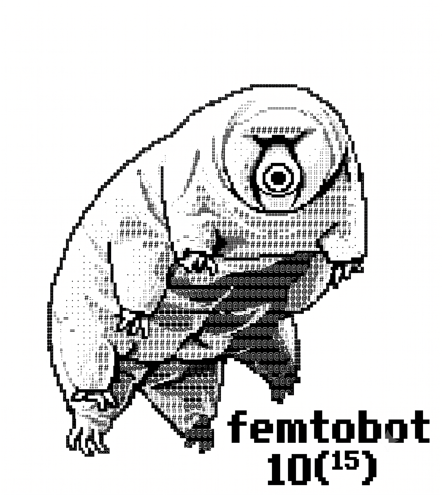
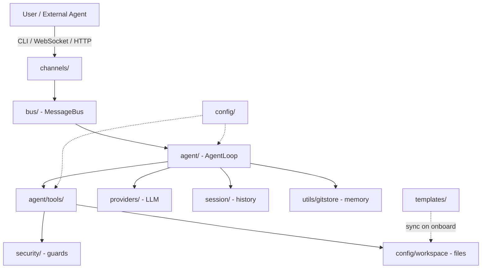

# Femtobot

<div align="center">
  
</div>

<div align="center">

[](https://www.python.org/)
[](./LICENSE)
[](./pyproject.toml)

**A lightweight, CLI-first AI agent foundation for multi-agent systems.**

</div>

---

## Overview

**Femtobot** is a minimal, production-oriented AI agent built around a single principle: the command line is the right interface for engineers, and the network is the right interface for agents. It started as a focused derivative of [Nanobot](https://github.com/HKUDS/nanobot) and is being developed as part of the [percival.OS](https://github.com/bill-kopp-ai-dev/percival.OS) ecosystem.

Femtobot is designed to be a practical foundation for building specialized "worker" agents that plug into multi-agent architectures — Supervisor/Worker, Hierarchical, or Swarm — through a clean OpenAI-compatible API. Each Femtobot instance is a self-contained, containerizable unit: drop it into a Docker container, point it at any OpenAI-compatible LLM endpoint, and it is ready to serve requests or coordinate with peers.

## Why Femtobot

- **CLI-first.** No GUI to install, no dashboard to babysit. The terminal is the operator's surface; the HTTP/WebSocket surface is for other agents.
- **Multi-instance by design.** Run `.femtobot` for the default profile, `.femtobot_dev` for development, `.femtobot_billing` for production — all in parallel, fully isolated, no port collisions.
- **A2A-ready.** The built-in `femtobot serve` already speaks the OpenAI Chat Completions protocol, so any agent that can call OpenAI can call Femtobot. Stage 2 adds native Docker orchestration on top.
- **Bring your own model.** A unified provider layer (via `openai_compat_provider`) covers OpenAI, Anthropic (via compatible gateways), Ollama, LiteLLM, and dozens of regional providers — all registered declaratively in a single config.
- **Workspace-scoped safety.** Tools are sandboxed to a per-instance workspace, with SSRF protection, command guards, and a deny-list for destructive shell operations.
- **Minimal surface area.** Roughly 14,000 lines of Python across 85 well-scoped modules. No social channels, no embedded web UI, no bundled frontend assets.

## Features

### Agent core
- Async agent loop with streaming responses
- 20+ native tools: `read_file`, `write_file`, `apply_patch`, `exec` (sandboxed shell), `grep`, `find_files`, `web_search`, `web_fetch`, `message`, `self`, `mcp`, and more
- Tool schema built on a Template Method pattern with Pydantic v2
- Auto-compaction when the context window fills up
- Multi-turn continuation when the LLM hits its tool-call budget
- Slash command router (`/help`, `/status`, `/goal`, etc.)

### Workspaces and memory
- Per-instance workspaces with Git-backed memory (`MEMORY.md`, `history.jsonl`)
- Template seeding: `AGENTS.md`, `SOUL.md`, `USER.md` are synced on first run
- Workspace policy enforcement: tools cannot escape the project root
- Persistent session history with JSONL serialization

### Channels and transport
- WebSocket channel (the main interactive surface)
- aiohttp server exposing OpenAI-compatible endpoints (`/v1/chat/completions`, `/v1/models`, `/health`)
- Message bus for in-process pub/sub between subsystems

### Security
- SSRF protection on all HTTP-fetching tools
- Command guard with a deny-list of destructive shell patterns
- Workspace access scoping per turn
- Per-instance isolation (no cross-talk between `.femtobot_*`)

### Multi-provider LLM support
- Unified `openai_compat_provider` for any OpenAI-compatible endpoint
- Fallback provider with circuit-breaker semantics
- Preset system for one-line model swaps
- Multi-provider config (you can mix OpenAI, Anthropic, and a local Ollama in the same instance)

### Operational
- Typer-based CLI with Rich-formatted output
- Loguru logging with bridge to stdlib
- Single-file config (`config.json`) per instance
- Easy to containerize (no state outside the instance directory)

## Project Status

### Stage 1 — Femtobot Core (MVP CLI) — **Completed**
- [x] CLI framework (Typer + Rich)
- [x] Agent loop with LLM integration (OpenAI-compatible)
- [x] Native tools: filesystem, shell, web search/fetch, MCP bridge, self-tools
- [x] Multi-instance support (`onboard`, `status`, `agent`, `serve`, `gateway`)
- [x] Configuration via `config.json` (multi-provider)
- [x] Workspace management with `SOUL.md` / `USER.md` / `AGENTS.md` templates
- [x] WebSocket channel
- [x] OpenAI-compatible API server (`femtobot serve`)
- [x] Security: SSRF guard, workspace policy, command guard
- [x] Memory: workspace-scoped, Git-backed (`gitstore`)
- [x] MCP integration
- [x] Auto-compact context

### Stage 2 — A2A + Docker Integration — **Planned**
- [ ] Docker SDK integration for spawning worker containers
- [ ] A2A client for inter-agent communication
- [ ] Supervisor orchestration (percival.OS → Femtobot workers)
- [ ] Optional FastAPI upgrade for the A2A server

## Installation

Femtobot uses [uv](https://docs.astral.sh/uv/) for dependency management.

### Prerequisites

- Python 3.11 or newer
- [`uv`](https://docs.astral.sh/uv/getting-started/installation/) installed
- A Unix-like shell (Linux, macOS, or WSL)

### From source

```bash
git clone https://github.com/bill-kopp-ai-dev/femtobot.git
cd femtobot
uv sync
```

This will create a virtual environment and install all dependencies into `.venv/`.

### Verify the installation

```bash
uv run python -m femtobot --version
```

You should see:

```
███████╗ ███████╗ ███╗   ███╗ ████████╗ ...
Femtobot v0.0.2
```

## Quick Start

```bash
# 1. Initialize a default instance in the current directory
uv run femtobot onboard

# 2. Verify the instance is wired up
uv run femtobot status

# 3. Run the agent in single-shot mode
uv run femtobot agent -m "List the Python files in this project"

# 4. Or start an interactive session
uv run femtobot agent
```

That's it. Femtobot will sync the workspace templates, read your `config.json`, connect to the configured LLM provider, and start chatting.

## CLI Reference

Femtobot exposes a small, focused set of commands. Run `uv run femtobot --help` to see them all.

### `femtobot onboard`

Initialize a new Femtobot instance. Creates the instance directory, writes a default `config.json`, and syncs the workspace templates.

```bash
# Default instance at ./.femtobot/
uv run femtobot onboard

# Named instance at ./.femtobot_dev/
uv run femtobot onboard --suffix dev

# Instance in a specific parent folder
uv run femtobot onboard --folder-path /opt/agents --suffix billing

# Overwrite an existing config.json
uv run femtobot onboard --suffix dev --force
```

| Option | Alias | Description |
|---|---|---|
| `--suffix` | `-s` | Instance suffix (e.g. `dev`, `prod`, `billing`) |
| `--folder-path` | `-f` | Parent folder for the instance |
| `--force` |  | Overwrite an existing `config.json` |

### `femtobot status`

Show the current instance status: config path, workspace path, active model, and configured providers.

```bash
uv run femtobot status
uv run femtobot status --suffix dev
```

### `femtobot agent`

Run the agent. In interactive mode (no `-m`), you get a prompt; with `-m`, the agent runs a single turn and exits.

```bash
# Interactive
uv run femtobot agent
uv run femtobot agent --suffix dev

# Single-shot
uv run femtobot agent -m "Explain the layout of this codebase"
uv run femtobot agent --suffix prod -m "Summarize the last 5 commits"
```

| Option | Description |
|---|---|
| `-m, --message` | Run a single message and exit |
| `--suffix` | Instance suffix |

### `femtobot serve`

Start the OpenAI-compatible HTTP server. Other agents and tools can then call the agent via `POST /v1/chat/completions`.

```bash
uv run femtobot serve
uv run femtobot serve --suffix dev --host 0.0.0.0 --port 8000
```

| Endpoint | Method | Description |
|---|---|---|
| `/v1/chat/completions` | POST | OpenAI-compatible chat completion |
| `/v1/models` | GET | List available models |
| `/health` | GET | Liveness check |

### `femtobot gateway`

Start the WebSocket gateway. This is the primary interactive channel for clients that prefer a persistent connection.

```bash
uv run femtobot gateway
uv run femtobot gateway --suffix dev
```

## Multi-Instance Model

Femtobot supports multiple isolated instances on the same machine. Each instance has its own config, workspace, history, and port. The instance directory is determined by the `--suffix` and `--folder-path` flags, with the following resolution order:

1. `--config <path>` (if implemented in the future)
2. `--folder-path <path>` + `--suffix <suffix>` → `<path>/.femtobot_<suffix>/`
3. `FEMTOBOT_HOME` environment variable → `$FEMTOBOT_HOME/.femtobot_<suffix>/`
4. Current working directory: `./.femtobot_<suffix>/` (or `./.femtobot/` for the default)

Common directory layouts:

```text
.femtobot/                 # default instance
.femtobot_dev/             # development instance
.femtobot_prod/            # production instance
```

The suffix must match `[a-zA-Z0-9_-]+`. Examples of valid suffixes: `dev`, `prod`, `billing_2024`, `agent-test`. Invalid: `dev env`, `test/path`, `..`.

### Environment variables

| Variable | Description |
|---|---|
| `FEMTOBOT_HOME` | Sets a fixed instance root directory |
| `FEMTOBOT_TMUX_SOCKET_DIR` | Directory for tmux sockets used by the gateway |

## Configuration

Each instance stores its configuration at `<instance_dir>/config.json`. Keep secrets out of version control.

### Minimal `config.json`

```json
{
  "agents": {
    "defaults": {
      "model": "gpt-4o-mini",
      "workspace": "./workspace"
    }
  },
  "providers": {
    "openai": {
      "type": "openai_compat",
      "base_url": "https://api.openai.com/v1",
      "api_key": "${OPENAI_API_KEY}"
    }
  }
}
```

### Top-level keys

| Key | Purpose |
|---|---|
| `agents.defaults` | Default agent behavior (model, workspace, max iterations) |
| `agents.list` | Named agent profiles |
| `providers` | LLM provider registry (OpenAI, Anthropic, custom gateways) |
| `tools` | Tool enable/disable and per-tool configuration |
| `security` | Workspace policy, command guard settings |
| `gateway` | Gateway host/port |
| `api` | OpenAI-compat server host/port |

Environment variables in config values (e.g. `${OPENAI_API_KEY}`) are expanded at load time.

## Troubleshooting

### `status` shows an unexpected default model

Femtobot stores its configuration in `<instance_dir>/config.json`. The default model is whatever is set in the `agents.defaults.model` key of that file. If `femtobot status` reports a model you did not choose (for example, a leftover from a previous developer machine), reset the instance config with:

```bash
uv run femtobot onboard --suffix <name> --force
```

This rewrites `config.json` with the bundled defaults and re-syncs the workspace templates. Your conversations, memory, and git history inside the instance are not touched.

### Reset a single instance

If an instance is in a bad state (corrupt config, accidental `--force` overwrite, etc.), delete the instance directory and re-create it from scratch:

```bash
rm -rf .femtobot_<suffix>
uv run femtobot onboard --suffix <suffix>
```

### WebSocket gateway does not start

Make sure the configured port is free. Femtobot does not retry on `EADDRINUSE` — pick another port with `--port` and update your client accordingly.

## Workspace

Each instance has a workspace directory. By default it lives at `<instance_dir>/workspace/`. The workspace is the only directory the agent's tools can read from and write to (unless explicitly granted wider access).

```text
.femtobot/
├── config.json
├── history/
│   └── cli_history
└── workspace/
    ├── AGENTS.md           # system prompt seeding
    ├── SOUL.md             # persona file
    ├── USER.md             # user profile
    ├── .templates/         # cached template copies
    ├── memory/
    │   ├── MEMORY.md
    │   └── history.jsonl
    ├── sessions/           # per-session JSONL logs
    ├── tool_results/       # cached tool outputs
    └── artifacts/          # generated files
```

`AGENTS.md`, `SOUL.md`, and `USER.md` are seeded from the bundled `templates/` directory on first run and never overwritten. You can edit them freely.

## Tools

Femtobot ships with a curated set of native tools. Each tool is implemented as a subclass of `Tool` (in `femtobot/agent/tools/base.py`) and registered with the central `ToolRegistry`.

| Tool | Purpose |
|---|---|
| `read_file` | Read a file from the workspace, with image MIME detection |
| `write_file` | Write or overwrite a file in the workspace |
| `apply_patch` | Apply a unified diff / patch |
| `exec` | Run a shell command (sandboxed by `command_guard`) |
| `exec_session` | Run a long-lived interactive shell session |
| `grep` | Ripgrep-style content search across the workspace |
| `find_files` | Glob/find files by name pattern |
| `web_search` | Search the web via a configured provider |
| `web_fetch` | Fetch and extract content from a URL |
| `message` | Send a message back to the user (the "final answer" tool) |
| `self` | Read/write the agent's own runtime variables |
| `mcp` | Bridge to Model Context Protocol servers |

Tools are configurable per-instance via the `tools` section of `config.json`. You can disable specific tools or tune their parameters (timeouts, max output, allow-lists).

## Architecture

Femtobot is organized in clear layers, from the user surface down to the LLM provider:



Layer responsibilities:

| Layer | Responsibility |
|---|---|
| `cli/`, `channels/` | User-facing input (terminal, WebSocket, HTTP) |
| `bus/` | In-process event bus decoupling producers from consumers |
| `session/` | Per-conversation state, goals, turn continuation |
| `agent/` | The core loop, runner, context window management, memory |
| `agent/tools/` | Concrete capabilities the LLM can invoke |
| `providers/` | LLM API abstraction (unified OpenAI-compat layer) |
| `security/` | SSRF, command guard, workspace policy |
| `config/` | Pydantic schema, JSON loader, path resolution |
| `templates/` | Bundled system-prompt seeds |
| `utils/` | Shared helpers (path, runtime, logging, gitstore) |

## Development

To develop on Femtobot, clone the repository and install in editable mode with dev extras:

```bash
git clone https://github.com/bill-kopp-ai-dev/femtobot.git
cd femtobot
uv sync --all-extras
```

### Project layout

```
femtobot/
├── agent/                  # core loop
│   ├── loop.py
│   ├── runner.py
│   ├── memory.py
│   ├── context.py
│   ├── autocompact.py
│   ├── hook.py
│   ├── progress_hook.py
│   ├── model_presets.py
│   └── skills.py
├── agent/tools/            # 20+ native tools
│   ├── base.py             # Tool ABC + Schema Template Method
│   ├── registry.py
│   ├── _constants.py
│   ├── shell.py
│   ├── filesystem.py
│   ├── search.py
│   ├── web.py
│   ├── mcp.py
│   └── ... (read_file, write_file, apply_patch, exec_session, etc.)
├── api/server.py           # aiohttp OpenAI-compat server
├── bus/                    # MessageBus + event types
├── channels/               # base, websocket
├── cli/commands.py
├── command/                # slash command router
├── config/                 # loader, paths, schema
├── pairing/                # stubs (CLI-first, no approval)
├── providers/              # unified openai_compat_provider + registry
├── security/               # command_guard, network, workspace_access, workspace_policy
├── session/                # manager, goal_state, turn_continuation
├── templates/              # AGENTS.md, SOUL.md, USER.md, agent/, memory/
└── utils/                  # helpers, path, runtime, llm_runtime, gitstore, ...
```

### Running from source

```bash
# Run any CLI command through uv
uv run python -m femtobot --help
uv run python -m femtobot agent -m "Hello"
```

### Linting and formatting

The project uses [ruff](https://github.com/astral-sh/ruff) for both:

```bash
uv run ruff check .
uv run ruff format .
```

## Roadmap

**Stage 2 (planned)** focuses on multi-agent coordination:

- **Docker SDK integration.** A `supervisor.py` module that uses `docker.from_env()` to spawn Femtobot containers as workers, with workspace volumes bind-mounted and a discovery layer over the Docker network.
- **A2A client.** A typed client for inter-agent calls over the OpenAI-compatible API, with TTL metadata to prevent A2A loops.
- **percival.OS orchestration.** A higher-level orchestrator that treats Femtobot instances as a pool of workers, dispatching tasks by capability.

**Stage 3 (exploratory)** may include:

- FastAPI upgrade for the A2A server (currently aiohttp)
- Logfire / OpenTelemetry instrumentation
- Web UI as an opt-in, separately-installable package

## Contributing

Contributions are welcome. Please open an issue first to discuss substantial changes, and keep pull requests focused.

Before submitting a PR:

1. Make sure `uv run ruff check .` passes.
2. Update the README and any relevant docs in `docs/`.
3. Add or update tests if you change behavior (the test suite is being rebuilt from scratch in this stage).

## Acknowledgements

- Based on ideas and core patterns from [Nanobot](https://github.com/HKUDS/nanobot).
- Built to integrate into the [percival.OS](https://github.com/bill-kopp-ai-dev/percival.OS) Agentic Operating System as a worker-agent foundation.
- Powered by an excellent open-source stack: [Typer](https://typer.tiangolo.com/), [Rich](https://rich.readthedocs.io/), [Pydantic](https://docs.pydantic.dev/), [aiohttp](https://docs.aiohttp.org/), [loguru](https://loguru.readthedocs.io/), and the [Model Context Protocol](https://modelcontextprotocol.io/).

## License

MIT — see [LICENSE](./LICENSE).
